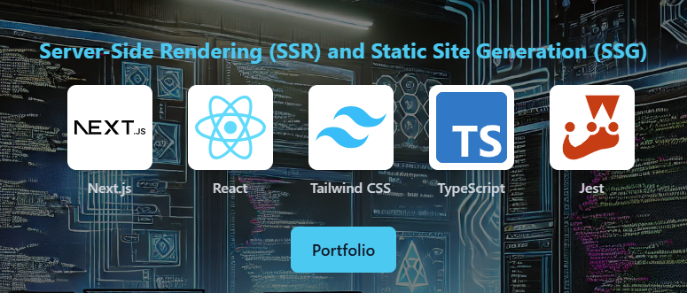
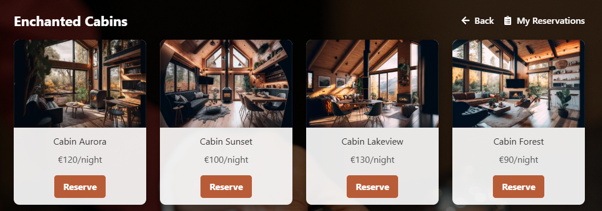
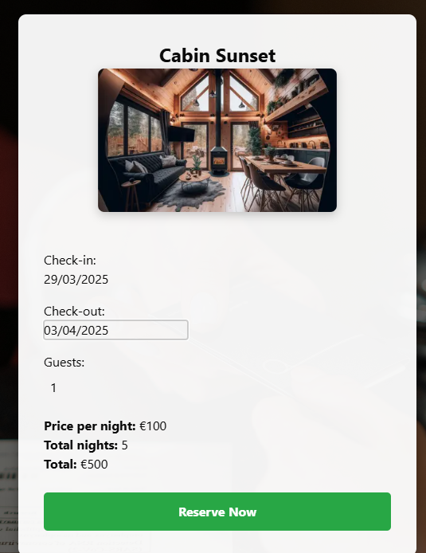
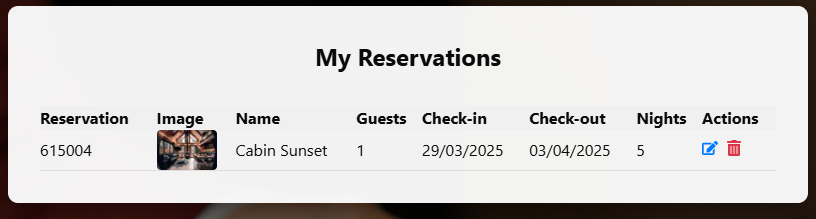

## Cabin Reservation System - React SSR 19

## Description:
A dynamic and efficient cabin reservation system built with React SSR 19. This web application allows users to make reservations, and manage bookings.


[](https://www.youtube.com/watch?v=Wbrw6EPX1W4)Add commentMore actions










## Getting Started

```bash
npm install
# or
yarn install
# or
pnpm install
# or
bun install
```

run the development server:

```bash
npm run dev
# or
yarn dev
# or
pnpm dev
# or
bun dev
```

